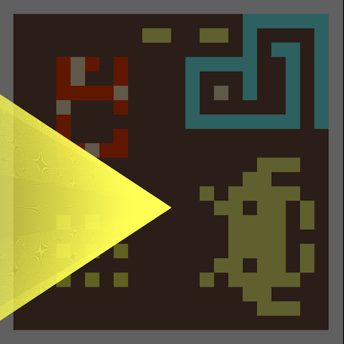

# Raycasting

## References

 * https://lodev.org/cgtutor/raycasting.html
 * https://grantshandy.github.io/posts/raycasting/
 * https://permadi.com/1996/05/ray-casting-tutorial-table-of-contents/
 
## Tasks

1. Implement a game "mini-map" (view from the above) showing a game field, and a player with infinite "light rays" pointed in the view direction.

   
   
2. Implement collision handling between the player and the walls.
